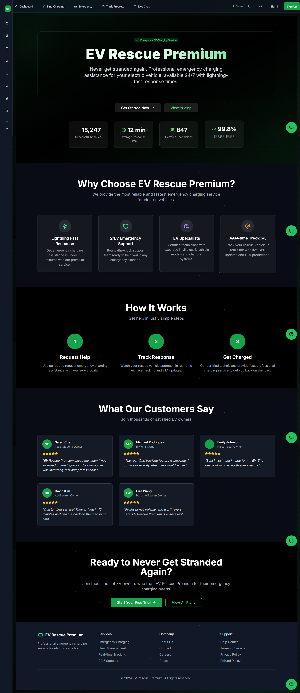
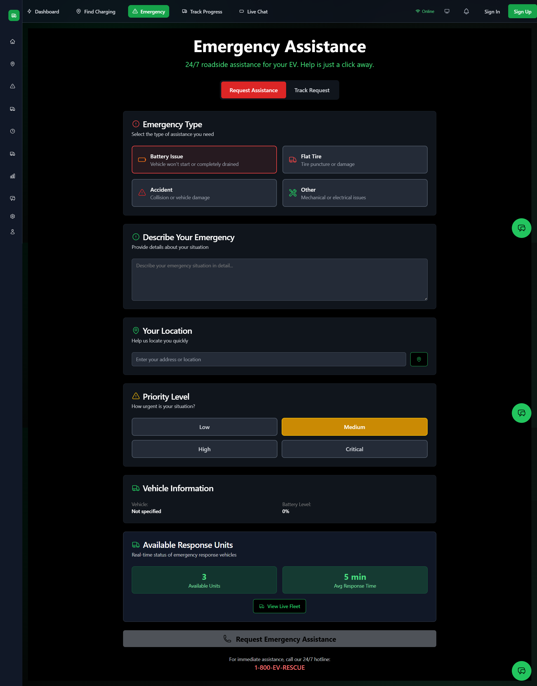
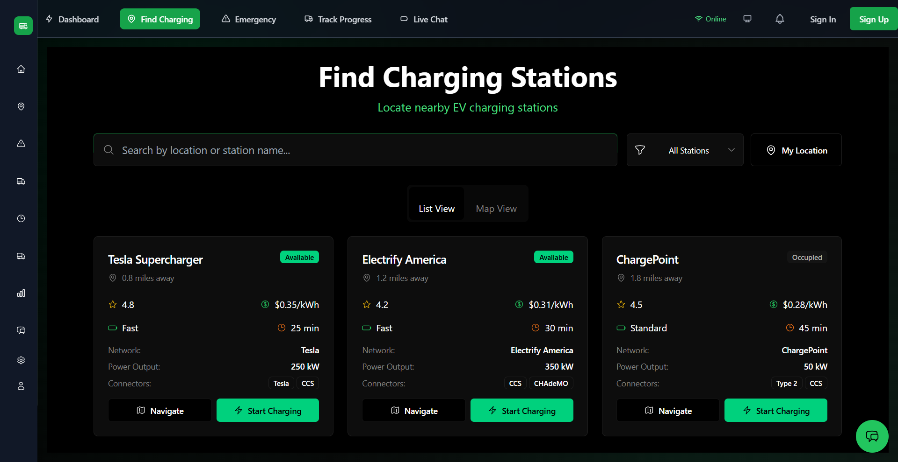
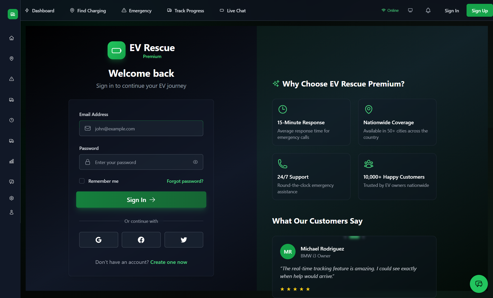
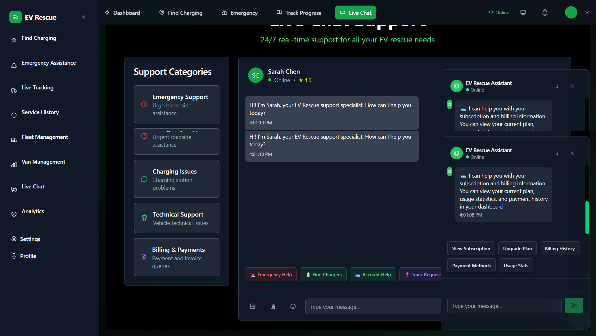
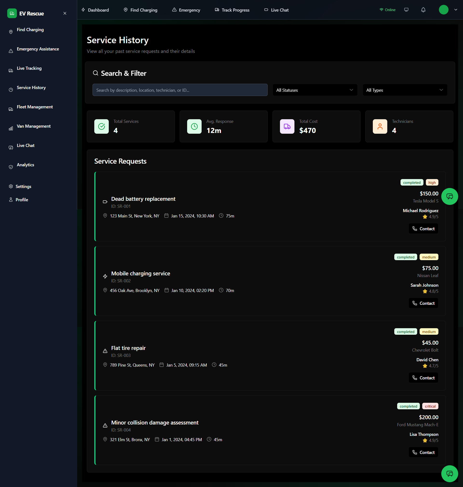
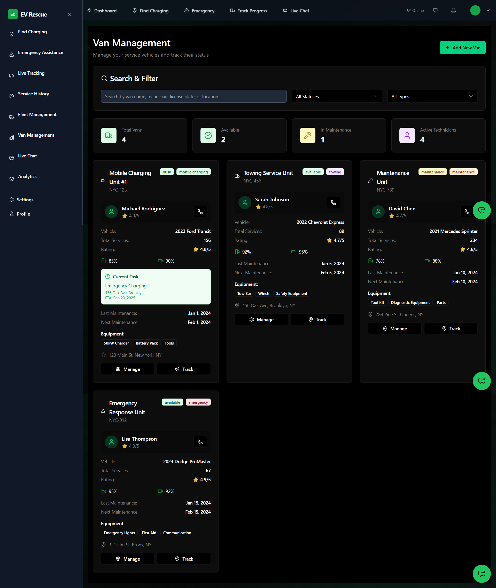

# EV Rescue Premium

A comprehensive emergency charging service platform for electric vehicles, providing real-time assistance and fleet management capabilities.

## Features

- **Emergency Charging Requests**: Quick and easy emergency charging assistance
- **Charging Station Finder**: Locate nearby charging stations
- **Service History**: Complete service history and maintenance records
- **Van Management**: Comprehensive van fleet management and tracking
- **Analytics Dashboard**: Performance metrics and insights
- **Service Provider Network**: Connect with certified EV service providers

## Screenshots

### Dashboard Overview


*Main dashboard showing fleet overview and real-time metrics*

### Emergency Request Flow


*Emergency charging request interface*

### Charging Station Finder


*Interactive map for finding nearby charging stations*

### User Login & Authentication


*Secure user authentication and registration system*

### Live Chat Support


*Real-time customer support and assistance chat*

### Service History


*Complete service history and maintenance records*

### Van Management


*Comprehensive van fleet management and tracking*

## Tech Stack

- **Frontend**: Next.js 15, React, TypeScript
- **Styling**: Tailwind CSS
- **Backend**: Firebase (Firestore, Authentication, Storage)
- **Maps**: Leaflet.js
- **Icons**: Tabler Icons
- **Deployment**: Vercel

## Getting Started

1. Clone the repository
2. Install dependencies: `npm install`
3. Set up environment variables
4. Run development server: `npm run dev`

## Environment Variables

Create a `.env.local` file with your Firebase configuration:

```env
NEXT_PUBLIC_FIREBASE_API_KEY=your_api_key
NEXT_PUBLIC_FIREBASE_AUTH_DOMAIN=your_auth_domain
NEXT_PUBLIC_FIREBASE_PROJECT_ID=your_project_id
# ... other Firebase config
```

## Scripts

- `npm run dev` - Start development server
- `npm run build` - Build for production
- `npm run start` - Start production server
- `npm run lint` - Run ESLint## License

Private project - All rights reserved.
